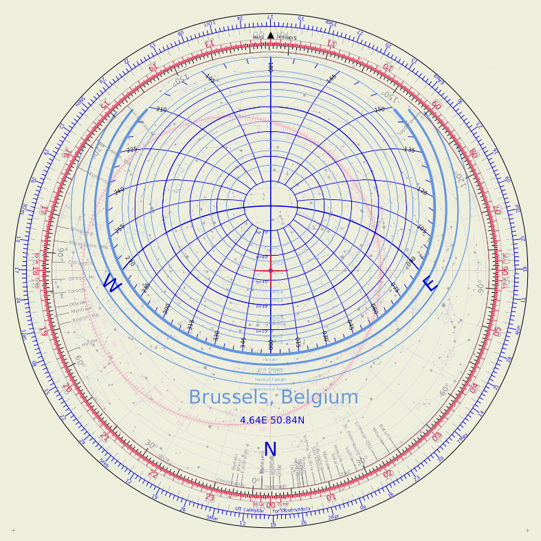
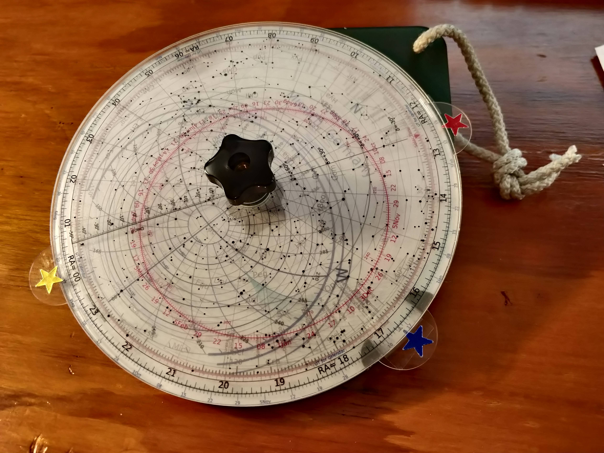

# astrolabe
Plots the elements of an astrolabe

 This tool will generates astrolabes for any location as a series of PDF files, which can be assembled in fully functional, high precision astrolabes. These can be used to prepare observations, to perform a series of astronomical calculation -such as time of sunset, sunrise, time of twilight, rise, transit, set of any star, calculation of the elevation and azimuth of any star.

One can generate traditional astrolabe, in stereographic projection as seen from outside the celestial sphere. This is useful to understand how traditional astrolabe work, or to study a real ancient astrolabe and rebuild description --eg identifying the stars on its rete, or identifying cryptic inscriptions. One can also generate "modern" astrolabes, using a much more compact polar projection and viewing the celestial sphere from the inside. 

This script is deployed as a [web-tool](https://www.eso.org/~ohainaut/bin/astrolabe.cgi).

The instructions to assemble and use the astrolabe are [here](https://www.eso.org/~ohainaut/astrolabe/manual.html).

The plots will look like this:

Once mounted, it could look like this:

## Files

- Astrolabe.py : main script

- const.dat : constellations

- hr.dat : bright stars

- landold.dat : standard stars

- obsClean.dat : list of observatories

- astrolabe_*pdf: a set of example output for the VLT

## Usage

- Astrolabe.py CGIobs  CODE  POLAR INOUTSIDE

CODE is the observatory code from obsClean

or 

- Astrolabe.py CGIcoo LONG LAT  POLAR INOUTSIDE

LONG LAT are the longitude (West>0) and latitude in degrees

POLAR: polar or stereo, projection of the astrolabe

INOUTSIDE: inside or outside, whether the observer is in or out of the celestial sphere.

Examples:

- Astrolabe.py CGIobs  144 polar inside : a practical astrolabe for the VLT observatory

- Astrolabe.py CGIcoo -4.7 37.9 stereo outside : an historical astrolabe for Cordoba, Spain (with the city's coordinates).

## Credits

 This program was originally (last millenium) written in Fortran, using SuperMongo for the graphics (SM, by Robert Lupton and Patricia Monger). It has been re-written from scratch using Python and matplotlib, resulting in (even :) nicer graphics and much lighter code...

These astrolabes (the original version) were used during the TOPS workshop (1995, Kamuela, HI) in an activity to get students and teachers more quickly familiar with the night sky and to easily give them the ability to plan observations. This has been included in the PSIgate Physical Sciences Information Gateway, http://www.psigate.ac.uk, a free online catalogue of high quality Internet resources in the physical sciences.

The observatory and city list comes mostly from that included in XEphem, the great interactive astronomical ephemeris program for X-Windows by ecdowney@ClearSkyInstitute.com, with personal additions and deletions. Any errors in the current list is mine.

The stars are from the Yale Catalogue of Bright Stars.. The constellation lines were compiled by Martin Krzywinski.

Several subroutines come from "Astronomical Formulae for Calculators" by Jean Meeus. Richmond, Va., U.S.A., Willmann-Bell, (c) 1982. 

